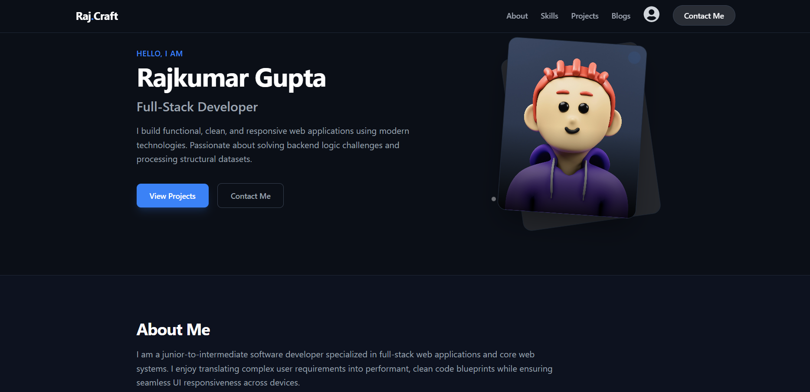
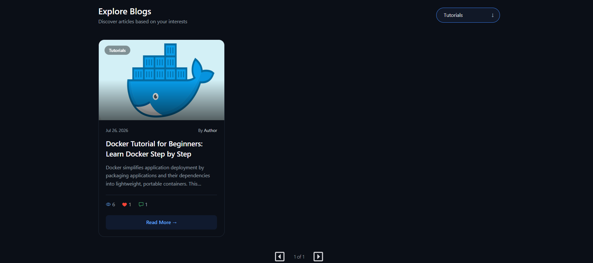
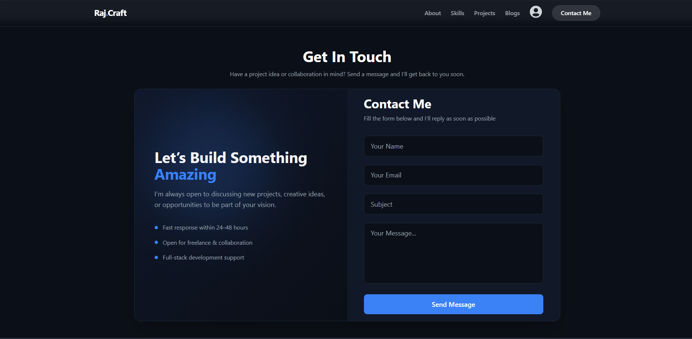
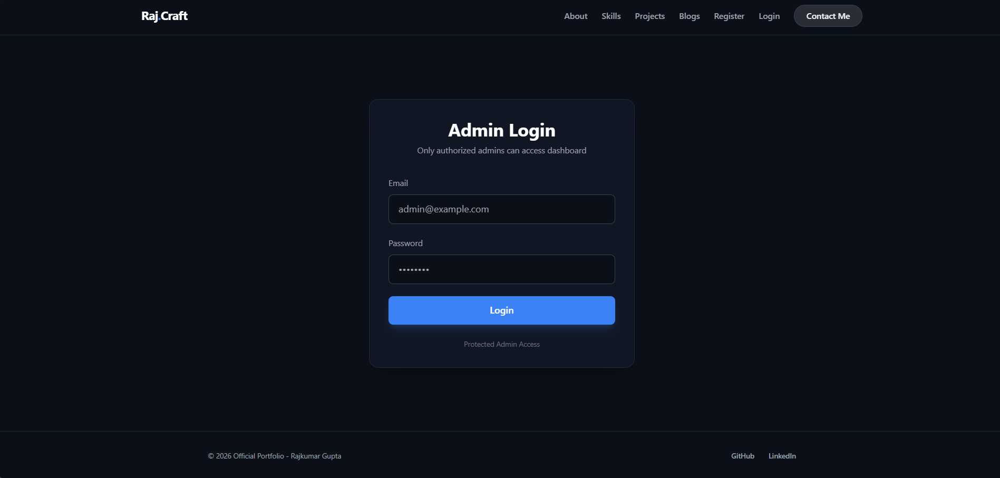
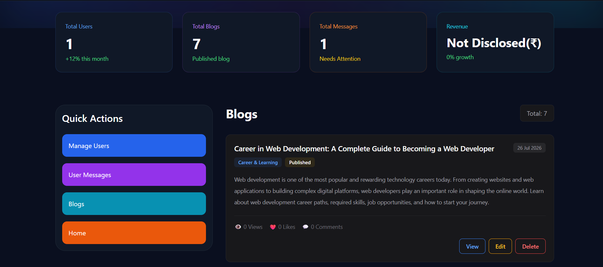
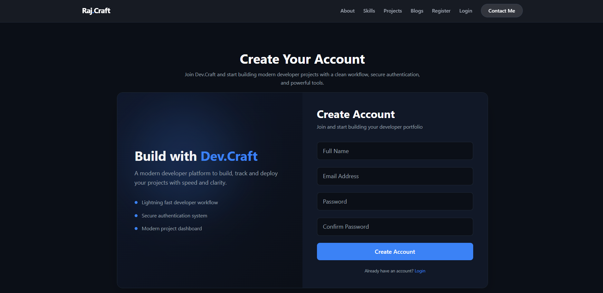
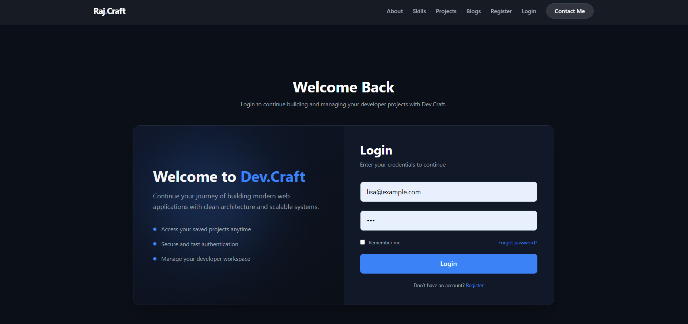
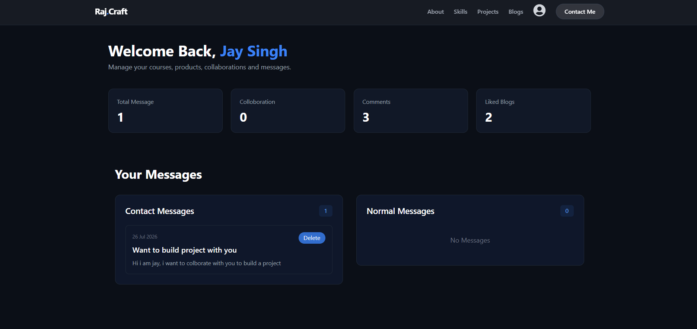

# **My Official Portfolio Website**


A modern, full-stack **Portfolio & Blogging Platform** built using the **MERN Stack** with **Vite React**, **MongoDB Atlas**, **Tailwind CSS**, and **JWT Authentication**. The platform serves as a professional portfolio while also providing a complete blogging system, user management, messaging, and an admin dashboard.



## **Overview**

This project is designed to showcase my portfolio, technical skills, and projects while providing visitors with an interactive blogging experience.

The application supports two roles:

- **Admin** – Manages blogs, users, messages, comments, and the entire platform.
- **User** – Can register, log in, read blogs, interact with blogs, and manage personal activities.


# Features

## Portfolio Website

- Responsive Home Page
- About Section
- Skills Section
- Projects Showcase
- Contact Section
- Message Form
- Beautiful UI with Tailwind CSS
- Fully Responsive Design


## User Authentication

- User Registration
- User Login
- Secure Password Hashing
- JWT Authentication
- Protected Routes
- Persistent Login
- Logout Functionality


## Blog System


- Pagination (Previous/Next page navigation)
- Blog cards (with title, excerpt, views, likes, comments, read button)
- Beautiful UI

### Admin

- Create Blog
- Write blogs using the **TinyMCE Rich Text Editor**
- Edit Blog
- Delete Blog
- Upload Images (for thumbnail)
- Rich Blog Content
- View All Blogs with category

### Users

- Read Blogs
- Comment on Blogs
- Like Blogs
- Dislike Blogs
- View Blog Details


## Contact System

Visitors can send official inquiries using the Contact Me form.

Admin can:

- View Contact Messages
- Delete Contact Messages


## Message System



Registered users can send messages.

Users can:

- View Their Messages
- Delete Their Messages

Admin can:

- View All Messages
- Delete Any Message


## Admin Dashboard




The Admin Panel includes management features for:

- Dashboard Overview
- Users Management
- Blog Management
- Contact Messages
- User Messages
- Delete Records
- Secure Admin Authentication


## User Dashboard






Users have access to:

- Profile Information
- My Messages
- My Comments
- Liked Blogs
- Delete Own Messages
- Account Management


# Tech Stack

## Frontend

- React.js
- Vite
- Tailwind CSS
- HTML5
- CSS3
- JavaScript (ES6+)
- React Router DOM
- **TinyMCE Rich Text Editor**


## Backend

- Node.js
- Express.js
- MongoDB Atlas
- Mongoose
- JWT Authentication
- bcrypt
- localStorage
- dotenv
- CORS


## Database

- MongoDB Atlas


# Project Structure

```text
portfolio-website/
│
├── client/
│   ├── public/
│   ├── src/
│   ├── tailwind.config.js   
│   ├── postcss.config.js   
│   └── package.json
│
├── server/
│   ├── config/
│   ├── Middleware/
│   ├── MongoDB/
│   ├── RouterController/
│   ├── server.js
│   └── package.json
│
├── README.md
└── .gitignore
```


# Pages

### Public

- Home
- About
- Skills
- Projects
- Blogs
- Blog Details
- Login
- Register
- Contact

### User

- Dashboard
- My Messages
- My Comments
- Liked Blogs

### Admin

- Dashboard
- Manage Blogs
- Write Blog
- Edit Blog
- Manage Users
- Manage Messages
- Manage Contact Messages


# Authentication & Authorization

### Guest

- View Portfolio
- Read Blogs
- Register
- Login
- Contact Admin

### User

- Read Blogs
- Comment
- Like/Dislike Blogs
- Manage Own Messages
- Access Dashboard

### Admin

- Full Access
- CRUD Blogs
- Manage Users
- Manage Comments
- Manage Messages
- Manage Contact Requests


# Installation

## Clone Repository

```bash
git clone https://github.com/iamraj333/official-portfolio
```

```bash
cd official-portfolio
```


## Install Frontend Dependencies

```bash
cd client
npm install
```


## Install Backend Dependencies

```bash
cd ../server
npm install
```

---

# ⚙️ Environment Variables

Create a `.env` file inside the **server** folder.

```env
MONGO_URL=your_mongodb_atlas_connection_string

TOKEN_SECRET_KEY= your_jwt_secret
ADMIN_TOKEN_SECRET_KEY= your_admin_jwt_secret
ADMIN_TOKEN_EXPIRE= expiry token

# Server creation config
PORTNUM=3000
CLIENT_URL=http://localhost:5173

# Admin Credentials
ADMIN_EMAIL=your_admin_email
ADMIN_PASSWORD= your_admin_pass

# Cloudinary Config
CLOUD_NAME=your_cloud_name
CLOUD_API_KEY=your_api_key
CLOUD_SECRET_KEY=your_api_secret

```

Create a `.env` file inside the **client** folder.
```env
VITE_TINYMCE_API_KEY=your_secret_key

# Backend Url
VITE_CLIENT_URL=http://localhost:3000

# Profile Url
VITE_PROFILE_URL=your_profile_image
```

# Running the Project

## Start Backend

```bash
cd server
npm run dev
```


## Start Frontend

```bash
cd client
npm run dev
```

Frontend:

```
http://localhost:5173
```

Backend:

```
http://localhost:3000
```

---

# API Modules

- Authentication
- Users
- Blogs
- Comments
- Likes
- Contact Messages
- User Messages
- Admin Management

---

# Database Collections

- Users
- Blogs
- Messages
- ContactMessages

---

# Responsive Design

The website is fully responsive and optimized for:

- Desktop
- Laptop
- Tablet
- Mobile Devices

---

# Future Improvements

- Email Verification
- Forgot Password
- Reset Password
- Blog Search
- Tags
- Notifications
- User Profile Picture
- Dark Mode
- Bookmark Blogs
- Admin Analytics Dashboard
- Role-Based Access Control (RBAC)
- Two-Factor Authentication (2FA)


# Contributing

Contributions are welcome.

1. Fork the repository.
2. Create a feature branch.

```bash
git checkout -b feature-name
```

3. Commit your changes.

```bash
git commit -m "Add new feature"
```

4. Push to your branch.

```bash
git push origin feature-name
```

5. Open a Pull Request.


# Known Issues

- None at the moment.

If you find any issues, feel free to open an issue in the repository.


# **Author**

**Rajkumar Gupta**

- GitHub: https://github.com/iamraj333/
- LinkedIn: https://www.linkedin.com/in/guptarajkumar


If you found this project helpful, consider giving it a **⭐ Star** on GitHub.
